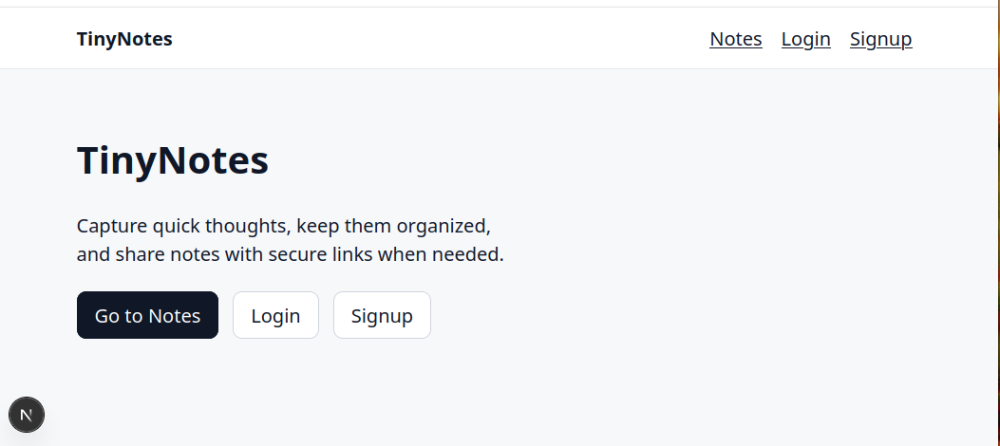

# Tiny Notes

A minimal, self-hosted journaling app built with Next.js and SQLite.

Tiny Notes focuses on simplicity: server-rendered pages, local-first data storage, and a clean writing experience without unnecessary complexity.

---

## ✨ Features

- 📝 Daily journal entries by date
- 🔐 Authentication (login/logout)
- 💾 SQLite database (easy backups)
- ⚡ Server Components for fast rendering
- 🧩 Server Actions for writes
- 🖼️ Image upload support
- 🗂️ Clean, simple UI

---

## 🏗️ Tech Stack

- Next.js (App Router)
- TypeScript
- SQLite
- Drizzle ORM
- Bun / Node.js

---

## 🚀 Getting Started

### 1. Install dependencies

```bash
bun install
# or
npm install
```

### 2. Set up environment

```bash
cp .env.example .env.local
```

Update values as needed.

### 3. Run database setup

```bash
bun run db:generate
bun run db:migrate
```

(or use `npx drizzle-kit migrate` if using npm)

### 4. Start development server

```bash
bun run dev
# or
npm run dev
```

Open:

http://localhost:3000

---

## 🧠 Architecture

This app follows a simple pattern:

- Server Components → reads  
- Server Actions → writes  
- SQLite → source of truth  

No client-side state management is required.

---

## 📦 Deployment

The app can be deployed:

- locally on a home server (Apache reverse proxy recommended)
- on platforms like Vercel (with adjustments for SQLite)

---

## 📝 Notes

- Data is stored locally in SQLite  
- Regular backups are recommended  
- Not intended for multi-user SaaS use  

---

## 📸 Screenshots



---

## 📄 License

MIT
